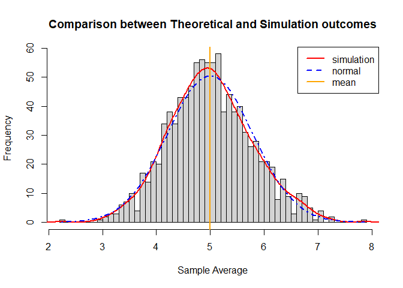

Anderson Hitoshi Uyekita
lubridate::today(tzone = “America/Sao_Paulo”)

# Statistical inference - Course Project: Part 1

-   Author: Anderson Hitoshi Uyekita
-   Date: Saturday, 02 July 2022

## Synopsis

This exercise aims to show the power of the central limit theorem (CLT),
comparing simulation results with theoretical expectations. The activity
is based on a sample of 1,000 means generated by 40 numbers (with an
exponential distribution profile with lambda 0.2). Then comparing those
values (the sample and theoretical) to prove the CLT. As a result, a
graph was plotted showing the sample’s normality, confirming the CLT.

## 1. Objectivies

-   Task 1: Show the sample mean and compare it to the theoretical mean
    of the distribution.
-   Task 2: Show how variable the sample is (via variance) and compare
    it to the theoretical variance of the distribution.
-   Task 3: Show that the distribution is approximately normal.

## 2. Requeriments and Settings

Please find the requirements and Settings to reproduce this experiment
in the APPENDIX section or Forking the [Github Repository]().

## 3. Parameters

According to Part 1 of the Course Project, the parameters of this
assignment should be:

``` r
# Parameters
simulations <- 1000; sample_size <- 40; lambda <- 0.2
```

## 4. Simulations

Preparing data to make an analysis:

``` r
raw_sample_exponential <- base::replicate(n = simulations, expr = rexp(sample_size, lambda))
sample_exponential <- base::apply(X = raw_sample_exponential, MARGIN = 2, FUN = mean)
```

The dataset created is a vector with 1000 of “means”.

## 5. Results

### 5.1. Sample Mean versus Theoretical Mean

**Theoretical Mean**: The Theoretical mean of a exponential distribution
rate is the inverse of lambda

``` r
theoretical_mean = 1 / lambda
```

So in this exercise the theorical mean is 5.

**Sample Mean**: The sample mean is showed bellow

``` r
sample_mean <- mean(sample_exponential)
```

The sample mean is 5.007542.

**Conclusions**

Based on the results above, those means are very close due to the great
amount of samples and simulations. This exercise shows the application
of the Central Limit Theorem.

### 5.2. Sample Variance versus Theoretical Variance

To calculate the variance is necessary one step before calculating the
standard deviation. Thus, this section is divided into 2 parts.

**Theoretical Standard Deviation**: The standard deviation is calculated
analytically as follow

``` r
theoretical_sd <- (1/lambda)/(sqrt(sample_size))
```

So in this exercise the theorical standard deviantion is 0.7905694.

**Sample Standard Deviation**: The sample standard deviation is showed
bellow

``` r
sample_sd <- sd(sample_exponential)
```

The sample standard deviation is 0.774678.

Using the standard deviation calculated above. It is possible to
calculate the variances.

**Theoretical Variance**: The Variance is the square of the standard
deviation

``` r
theoretical_varicane <- theoretical_sd^2
```

So in this exercise the theorical variance is 0.625.

**Sample Variance**:

``` r
sample_variance <- sd(sample_exponential)
```

The sample variance is 0.774678.

**Conclusions** Based on the results above, those variances are very
close due to the great amount of samples and simulations. This exercise
shows the application of the Central Limit Theorem.

### 5.3. Show that the distribution is approximately normal

Using graphs this question could be easily answered

``` r
# Histogram of averages
hist(sample_exponential, breaks=20, prob=TRUE,
     main="Comparison of simulation results and theoretical expected (lambda=0.2)",
     xlab="")

# Draw a line of Density of the averages of samples
lines(density(sample_exponential),lwd=2,col="red")

# Theoretical center of distribution. In other words, the theretical mean.
abline(v=1/lambda, col="red",lwd=2)

# Theoretical density of the averages of the simulations samples
xfit <- seq(min(sample_exponential), max(sample_exponential), length=100)
yfit <- dnorm(xfit, mean=1/lambda, sd=(1/lambda/sqrt(sample_size)))

# Draw a line of Theoretical
lines(xfit, yfit, pch=20, col="blue", lty=4,lwd=2)

# Add legend in the histogram
legend('topright', c("simulation", "theoretical"), lty=c(1,2), col=c("red", "blue"),lwd=2)
```

<!-- -->

**Conclusions** The simulation is approximately normal. The graphic
shows a histogram and a density line of a theoretical distribution,
those informations are very close. Due to the central limit theorem, the
averages of samples follow normal distribution.

<!-- Adding a Page Break to starting a new APPENDIX page -->
# APPENDIX

In order to reproduce this Course Project in any environment, please
find below the Packages, Seed definition and `SessionInfo()`.

### Requirements

``` r
# Loading libraries
library(ggplot2)

# Force results to be in English
Sys.setlocale("LC_ALL","English")

# Set seed
set.seed(2022)
```

### Session Info

    ## R version 4.2.0 (2022-04-22 ucrt)
    ## Platform: x86_64-w64-mingw32/x64 (64-bit)
    ## Running under: Windows 10 x64 (build 22000)
    ## 
    ## Matrix products: default
    ## 
    ## locale:
    ## [1] LC_COLLATE=English_United States.1252 
    ## [2] LC_CTYPE=English_United States.1252   
    ## [3] LC_MONETARY=English_United States.1252
    ## [4] LC_NUMERIC=C                          
    ## [5] LC_TIME=English_United States.1252    
    ## system code page: 65001
    ## 
    ## attached base packages:
    ## [1] stats     graphics  grDevices utils     datasets  methods   base     
    ## 
    ## other attached packages:
    ## [1] ggplot2_3.3.6
    ## 
    ## loaded via a namespace (and not attached):
    ##  [1] highr_0.9        pillar_1.7.0     compiler_4.2.0   tools_4.2.0     
    ##  [5] digest_0.6.29    lubridate_1.8.0  evaluate_0.15    lifecycle_1.0.1 
    ##  [9] tibble_3.1.7     gtable_0.3.0     pkgconfig_2.0.3  rlang_1.0.3     
    ## [13] cli_3.3.0        DBI_1.1.3        rstudioapi_0.13  yaml_2.3.5      
    ## [17] xfun_0.31        fastmap_1.1.0    withr_2.5.0      stringr_1.4.0   
    ## [21] dplyr_1.0.9      knitr_1.39.3     generics_0.1.2   vctrs_0.4.1     
    ## [25] grid_4.2.0       tidyselect_1.1.2 glue_1.6.2       R6_2.5.1        
    ## [29] fansi_1.0.3      rmarkdown_2.14   purrr_0.3.4      magrittr_2.0.3  
    ## [33] scales_1.2.0     ellipsis_0.3.2   htmltools_0.5.2  assertthat_0.2.1
    ## [37] colorspace_2.0-3 utf8_1.2.2       stringi_1.7.6    munsell_0.5.0   
    ## [41] crayon_1.5.1
